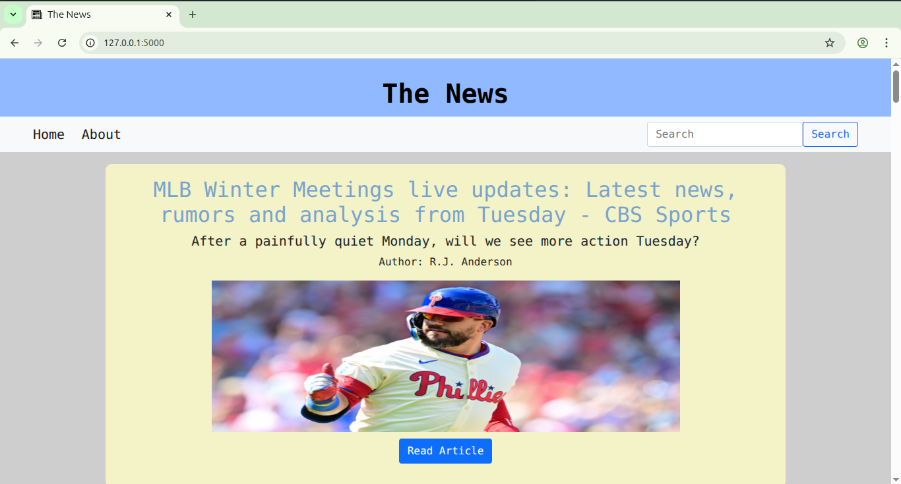

# The News
#### Video Demo: <https://youtu.be/x6GaBQppp-4>

#### Description:

This is a News website made with Flask. It's uses <a href="https://newsapi.org/">newsapi.org</a> to get a news.

#### Features:

* Search for the latest news.
* Clean and responsive user interface.
* Fully mobile-friendly layout.

#### Tech Stack:

* Python
* Flask
* NewsAPI
* HTML
* CSS
* Jinja Templates

#### Installation:

```bash
git clone https://github.com/Ranajit08/The_News
```
```bash
cd The_News
pip install -r requirements.txt
```

#### Run the project:
```bash
flask run --debug
```

#### Author:
* Ranajit Mitra
* Linkdin - https://www.linkedin.com/in/ranajit-mitra-1bb0342b2/